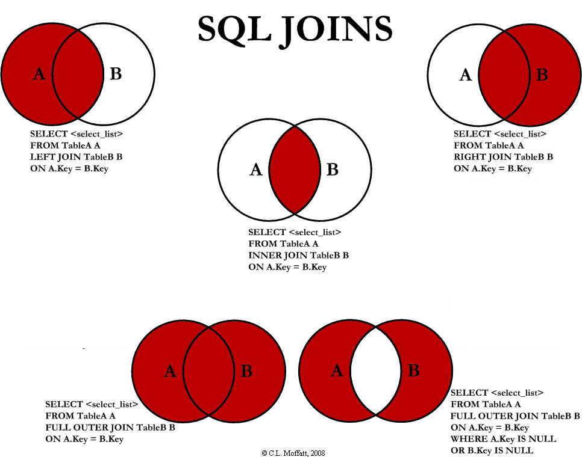

# Have you read the Instructor Guide?

You should before you teach anyone anything.

Have a question? It's probably in the Instructor Guide.

look at this file at the root of the repository: 
[Instructor Guide](https://github.com/RutgersCodingBootcamp/All-Lesson-Plans/blob/master/instructor_guide.md)

# Master Objectives (Internal Use - do not share with students - because it's a waste of time)
* Expertly navigate the file system and terminal basics
* Work independently or in a group on complex projects throughout the entire development lifecycle
* Implement complex logical conditions to meet an objective.
* Write SQL commands to perform Create, Read, Update and Delete commands
* Write clean code with proper variable names, indentation according to industry best practices

# Objectives (Slack out to students, have unique students read each one and Instructor makes a comment after each one being read)

1. slack out the objectives to the students, and call on random students to read them outloud. *Make a comment about each objective after a person reads it.*

1. in class repo for your section, make a new folder for this week and day.

1. open them up that folder in Sublime Text

1. make an objectives.txt file in that folder

1. copy these objectives into that objectives.txt file and save it, commit it, push it up.

1. keep the file open while the students are reading the objectives 

* Students will create a MySQL relational database, and create tables inside of it
* Students will use the JOIN clause in SQL to combine data from different tables
* Students will make a Node.js script connecting to their MySQL Database.
* Students will write code inside of a Node.js script to perform C.R.U.D on a MySQL database

# Theme: 
Using MySQL in a Node.js file

--------- --------- ---------

# INSTRUCTOR MUST COVER!!!

```
ALL or they won't be able to do the homework.
```

PART ONE:
---------

### 1. Partners do (5 minutes)

* *say this and slack it out:*

> Define what each of the letters in C.R.U.D stand for. Turn to your partners and talk about this. You are responsible for the people around you understanding C.R.U.D.

### 2. Everyone do (5 minutes)

* *Call on a weaker student to go over the previous exercise*

Solution:

* *Slack this out and commit this in your in class repo*

```
C - CREATE - INSERT INTO pets (name, type, age) VALUES ('fido', 'dog', 3);
R - READ - SELECT * FROM pets;
U - UDPATE - UPDATE pets SET name='under dog' WHERE type = 'dog';
D - DELETE - DELETE FROM pets WHERE type = 'mouse';
```

### 3. Student do (20 minutes)
* *Introduce the review exercise and explain what students need to do + bonus 
(review MySQL basics)* 

12.2.1 exercise 1: (simple MySQL db)

1. With the following steps, run the commands in the MySQL console, but also copy the commands into a movies.sql file, and push this file to a github repository 
1. Create a database in MySQL named movies
1. Make a table called samuel_l_jackson_movies
1. Insert the below data into the samuel_l_jackson_movies table
1. Update the last row in the table to year 2015
1. Delete the first row of the table
1. Find out how many total movies are in the table using a SQL query
1. Finish the bonus
1. Slack the instructor the github repository

| movie  | character  | year |
|------------| ------ |-------|
|Jackie Brown|Ordell Robbie|1997|
|Shaft|John Shaft|2000|
|Snakes on a Plane|Neville Flynn|2006 |
|Star Wars: The Clone Wars| Mace Windu |2008| 
|Captain America: The First Avenger | Nick Fury|2011 |
|Fury| Foley| 2012 |
|The Avengers | Nick Fury| 2012 |
|Django Unchained | Stephen| 2012 |
|Avengers: Age of Ultron| Nick Fury | 1015 |

BONUS:

* Using a sql statement, find all the movies where the year is equal to 2012 and doesn't have the character Nick Fury 

### 4. Everyone Do (10 minutes)

* *Go over the previous exercise with the class - call on one unique student per each part of the previous exercise to explain what they did for each part of the exercise*

###### 40 minutes have passed

### 5. Instructor do ( 15 minutes ) 

* *Create a database called countries*

12.2.2 demo 1: (Country and counties)
Demo issue that database can have with mulitple tables, ask student to help

```
Zhen put code in to make tables and make inserts into the below table. 
```

table: countries

|id|country|
|---------|-------|
|1|U.S.A|
|2|U.K|
|3|FRANCE|

table: cities

|id|city|hipsters|country_id|
|--------|----|--------------|---------|
|1|'paris'|85,000|3|
|2|'san francisco'|290,000|1|
|3|'london'|150,000|2|
|4|'new york city'|370,000|1|

Question is...in one sql statement how do get back the hipister count from all US citys in order?

`
SELECT * 
FROM countries 
LEFT JOIN cities 
ON countries.id=cities.country_id 
WHERE countries.id = 1
ORDER BY cities.hipsters;
`

### 7. Instructor do ( 15 mins ) 

* *Slack this out, put it on the screen and talk about each one. Save this to your in class code, commit and push.*

```
Relational database JOINs (INNER, LEFT, RIGHT, FULL):

INNER JOIN: Returns all rows when there is at least one match in BOTH tables

LEFT JOIN: Return all rows from the left table, and the matched rows from the right table

RIGHT JOIN: Return all rows from the right table, and the matched rows from the left table

FULL JOIN: Return all rows when there is a match in ONE of the tables
```

```
ZHEN chop off outer joins from this picture
```

* *Show this to students. Save this to your in class code, commit and push.*


### 8. Partners do ( 5 minutes )

> Explain to the people around you what each of these joins do and why they're used. I'll call on random people. If you're wrong, i'm going to call out the people next to you for not explaining it to you well.

### 9. Partners do ( 20 mins ) 

Objectives: 
* Students will run basic queries to make a database, tables, and populate those tables.
* Students will use join SQL clauses

1. Run all your commands in MySQL but also put all of them in chronological order inside of a fun_time.sql file
2. Create a database called fun_time
3. Inside fun_time, create a bars table with id, bar_name
4. bars table must have at least 3 different bars (3 rows with different names)
5. Create a 4th bar with the name of 'Moo Milk Bar' 
6. Inside fun_time, create a drinks table with id, bar_id, drink_name, drink_price
7. Create 3 different drinks in the drinks table (3 rows with different drink names, prices and bar_ids)
8. Create another drink in the drinks table with a bar_id of the 'Moo Milk Bar'
9. Create 1 drink that has no bar_id (because it's not available in any of the bars in your bars table)
10. Use the following SQL JOINS: LEFT, RIGHT, INNER, FULL

Bonus: 

* check out the Moo Milk Bar website http://www.moomilkbar.ca/#the-bakery

### 10. Instructor do ( 5 mins )
Demo and go over the exerices and ask student/partner to explain


### 12. Student present: ( 4 mins )
Slacked code from student, student explain code

### 13. Instructor do: ( 2 mins )
Demo and go over the exerices

BREAK: (15 mins)
---------

PART TWO:
---------

New Materials Intro:  ~85 mins

### 14. Student do: ( 5 mins )
Create a new Node App 
Install npm packages 

### 15. Instructor do: New concepts "block quotes": ( 5 mins )
12.2.5 demo 2: (basic mysql node app)
MySQL inside of Node
Connecting Node to mySQL via npm package, do a simple SELECT  from a db
```
App setup:
1.create App Dir
2.npm init
4.setup 'index.js' file

Database setup:
1.npm install mysql
2.mysql config
```
Basic setup: establishing connections
```
var mysql      = require('mysql');
var connection = mysql.createConnection({
  host     : 'example.org',
  user     : 'bob',
  password : 'secret'
});
 
connection.connect(function(err) {
  if (err) {
    console.error('error connecting: ' + err.stack);
    return;
  }
 
  console.log('connected as id ' + connection.threadId);
});
```

Connect to a db and do a simple selection
```
connection.query('SELECT * FROM someTable', function(err, res) {
  if (err) throw err;

  console.log(res);
});
```
* Notice that mySQL npm commands are a bit different compared to normal mySQL commands

### 16. Partners do: ( 8 mins )
Connecting Node to mySQL via npm package, do a simple SELECT from a db

### 17. Partners Demo: ( 2 mins )
Slacked code from student have have student partners explain what they did

### 18. Instructor do ( 2 mins )
12.2.5 exercise 4: (climbing gym members)
Introduce the reivew exercise and explain what student need to do + bonus 

Student Exercies: duration (long)
Connecting Node to mySQL via npm package
Create the functions of C.R.U.D in Node using a mySQL db

You are creating an App for a climbing gym, in this gym new members comes in with a sign up of 30 session.
Each time a member comes to visit the gym adds 1 to the session_used count which starts at 0, and record the current date.

Create a new db in mySQL:

* Create a table with PK(id), name, total session, session used, last session date.
* Create a new memeber with any name, 30 total sessions, 0 session used, and last session date set to false.
* Create a function that finds the number of session used by checking the name.
* Create a function that add 1 to the session used and update the last session date to current date.

Bonus: Create a function that checks total session against session used if it's both 30, delete the memeber

### 19. Partners do ( 3 mins )
Have student turn to eachother and talk about how to do this exerices before starting

### 20. Student do: ( 18 mins )
Work on exersice alone

### 21. Instructor do: ( 10 mins )
Teacher demo go over solution 

### 22. Partners do: ( 5 mins )
Student talk to each other, explain to each other the code

### 23. Instructor do: ( 5 mins ) 
12.2.6 exercise 5: (6 degrees of Kevin Bacon)
Teacher intro 1 JOIN mySQL

### 24. Partner do: ( 15 mins )
Work on exersice different JOIN in mySQL

### 25. Partners present: ( 3 mins )
Student explain demo

### 26. Instructor do: ( 4 mins )
Teacher demo go over solution 

(Instructor do): Review all topics

# Copyright
Coding Boot Camp (C) 2016. All Rights Reserved.